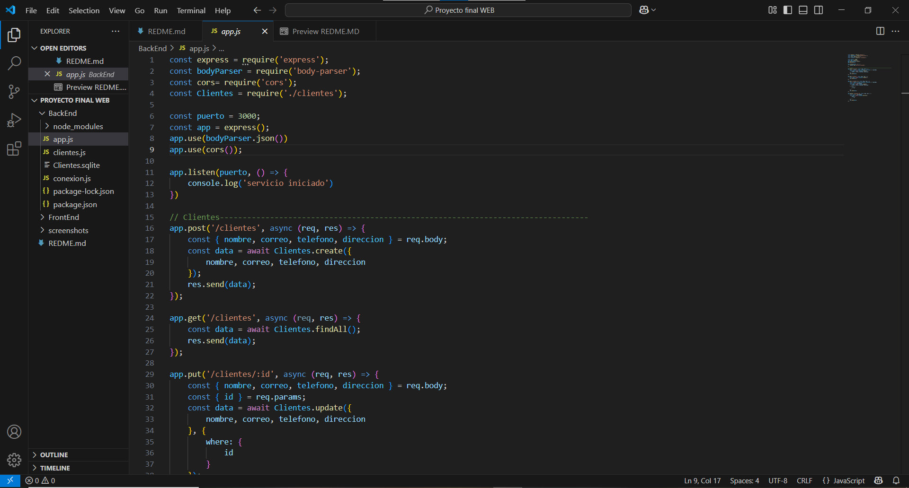
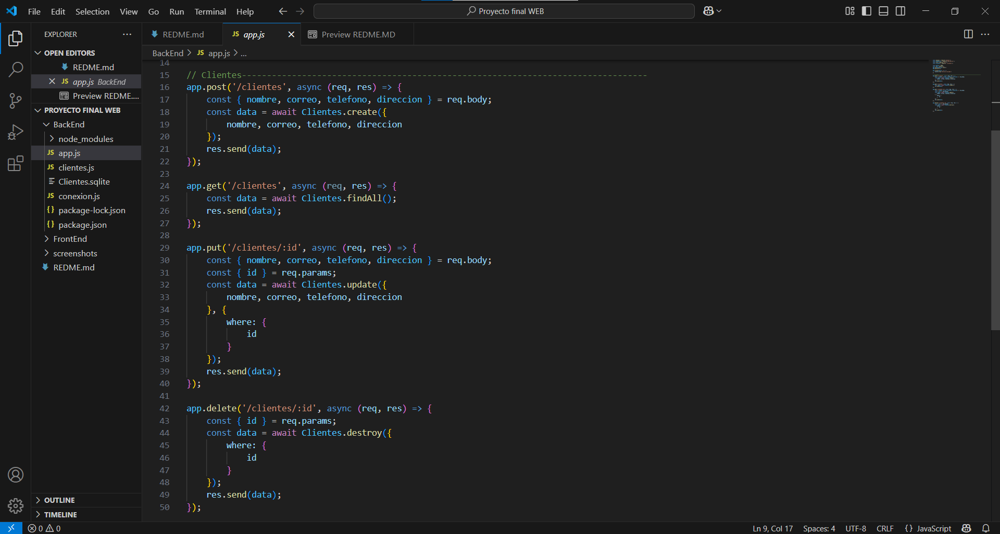
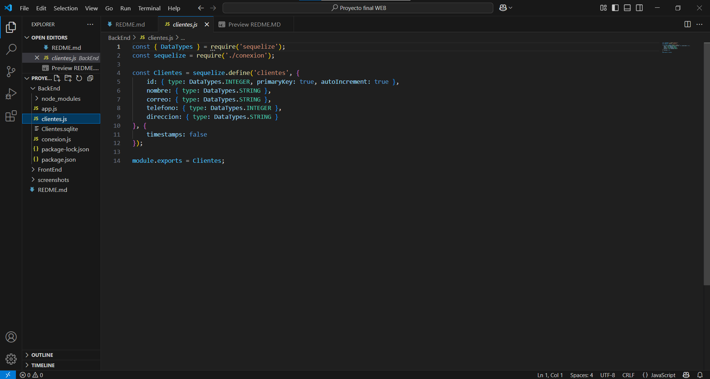
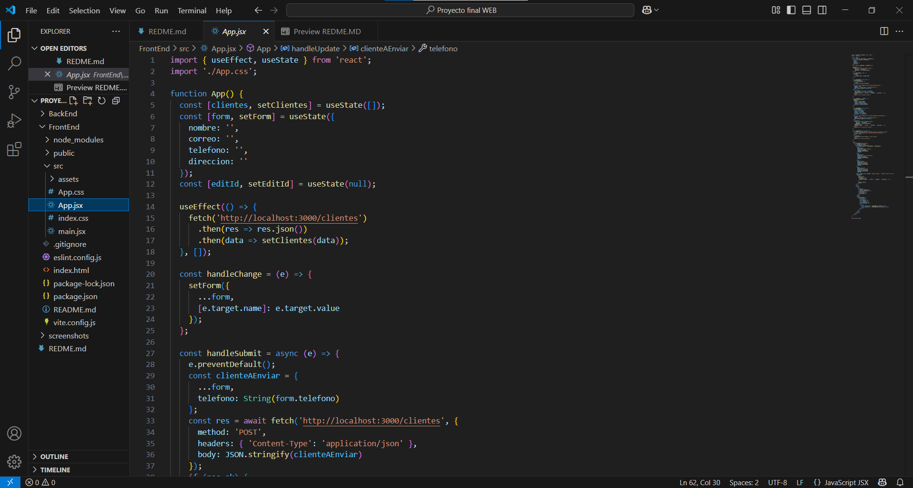
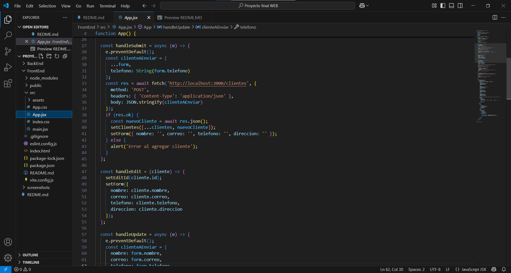
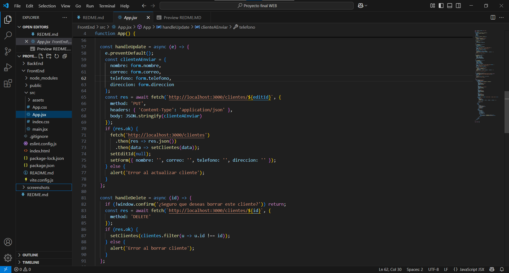
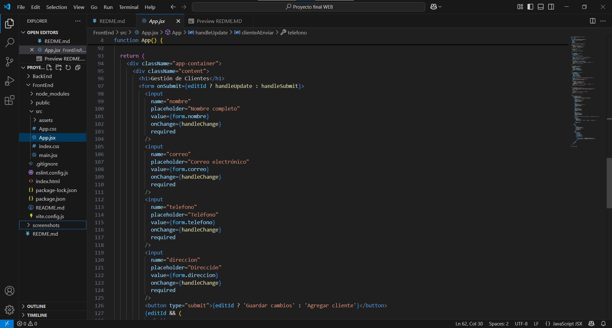
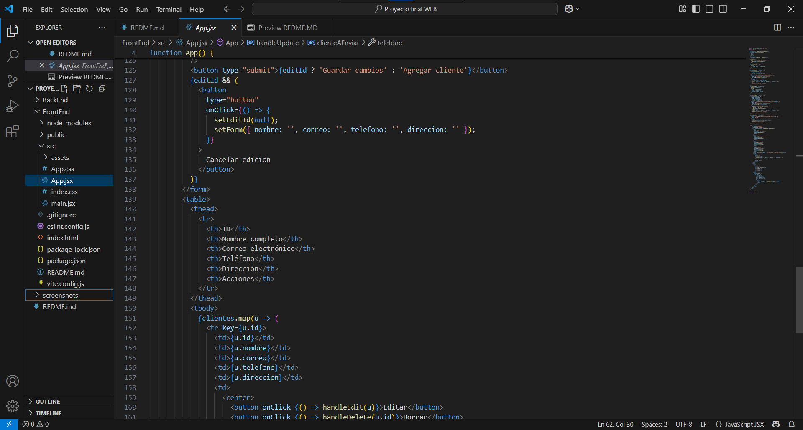
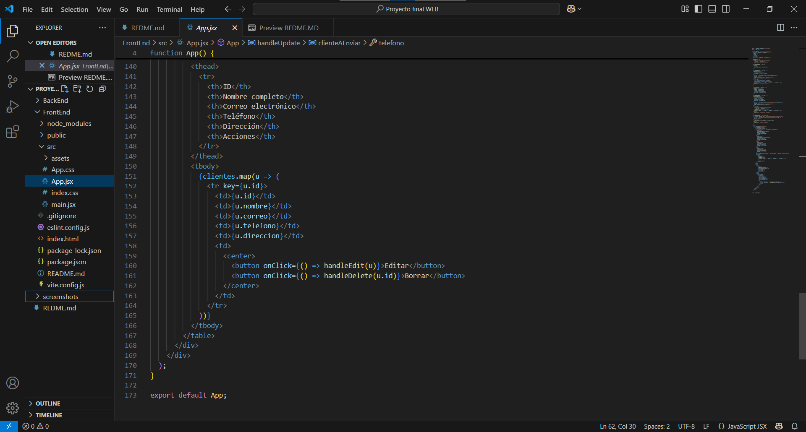
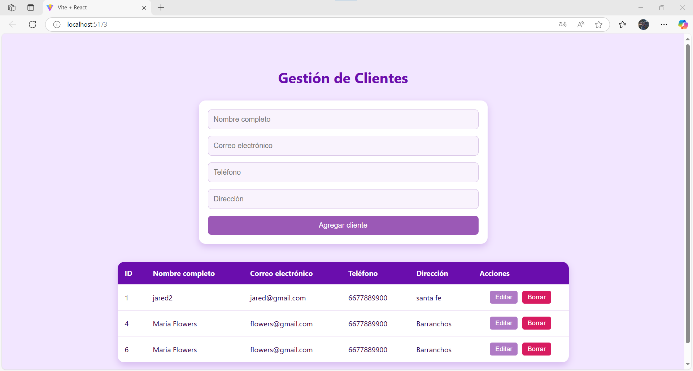

# Aplicación Web CRUD de Clientes

Este proyecto es una aplicación web completa para la gestión de clientes, implementando operaciones de **Crear, Leer, Actualizar y Eliminar (CRUD)**.  
Incluye un **frontend en React**, un **backend en Node.js con Express** y una **base de datos SQLite**.

---

## Estructura del Proyecto

```
Proyecto final WEB/
│
├── BackEnd/
│   ├── app.js
│   ├── Clientes.js
│   ├── conexion.js
│   ├── Clientes.sqlite
│   └── package.json
│
└── FrontEnd/
    ├── src/
    │   ├── App.jsx
    │   ├── App.css
    │   ├── main.jsx
    │   └── ...
    ├── index.html
    ├── package.json
    └── ...
```

---

## 1. Backend (Node.js + Express + Sequelize + SQLite)

### Configuración de la base de datos y modelo

```js
// conexion.js
const Sequelize = require('sequelize');
const sequelize = new Sequelize({
    dialect: 'sqlite',
    storage: './Clientes.sqlite'
});
module.exports = sequelize;
```

```js
// Clientes.js
const { DataTypes } = require('sequelize');
const sequelize = require('./conexion');

const Clientes = sequelize.define('clientes', {
    id: { type: DataTypes.INTEGER, primaryKey: true, autoIncrement: true },
    nombre: { type: DataTypes.STRING },
    correo: { type: DataTypes.STRING },
    telefono: { type: DataTypes.INTEGER },
    direccion: { type: DataTypes.STRING }
}, {
    timestamps: false
});

module.exports = Clientes;
```

### Endpoints principales

```js
// app.js
const express = require('express');
const bodyParser = require('body-parser');
const cors = require('cors');
const Clientes = require('./Clientes');

const puerto = 3000;
const app = express();
app.use(bodyParser.json());
app.use(cors());

// Crear cliente
app.post('/clientes', async (req, res) => {
    const { nombre, correo, telefono, direccion } = req.body;
    const data = await Clientes.create({ nombre, correo, telefono, direccion });
    res.send(data);
});

// Leer todos los clientes
app.get('/clientes', async (req, res) => {
    const data = await Clientes.findAll();
    res.send(data);
});

// Actualizar cliente
app.put('/clientes/:id', async (req, res) => {
    const { nombre, correo, telefono, direccion } = req.body;
    const { id } = req.params;
    await Clientes.update({ nombre, correo, telefono, direccion }, { where: { id } });
    res.send({ success: true });
});

// Eliminar cliente
app.delete('/clientes/:id', async (req, res) => {
    const { id } = req.params;
    await Clientes.destroy({ where: { id } });
    res.send({ success: true });
});

app.listen(puerto, () => {
    console.log('servicio iniciado');
});
```

---

## 2. Frontend (React)

### Estructura principal

```jsx
// App.jsx
import { useEffect, useState } from 'react';
import './App.css';

function App() {
  // Estados para clientes, formulario y edición
  const [clientes, setClientes] = useState([]);
  const [form, setForm] = useState({ nombre: '', correo: '', telefono: '', direccion: '' });
  const [editId, setEditId] = useState(null);

  // Leer clientes al cargar
  useEffect(() => {
    fetch('http://localhost:3000/clientes')
      .then(res => res.json())
      .then(data => setClientes(data));
  }, []);

  // Manejar cambios en el formulario
  const handleChange = (e) => {
    setForm({ ...form, [e.target.name]: e.target.value });
  };

  // Crear cliente
  const handleSubmit = async (e) => {
    e.preventDefault();
    const res = await fetch('http://localhost:3000/clientes', {
      method: 'POST',
      headers: { 'Content-Type': 'application/json' },
      body: JSON.stringify(form)
    });
    if (res.ok) {
      const nuevoCliente = await res.json();
      setClientes([...clientes, nuevoCliente]);
      setForm({ nombre: '', correo: '', telefono: '', direccion: '' });
    }
  };

  // Editar cliente
  const handleEdit = (cliente) => {
    setEditId(cliente.id);
    setForm({
      nombre: cliente.nombre,
      correo: cliente.correo,
      telefono: cliente.telefono,
      direccion: cliente.direccion
    });
  };

  // Actualizar cliente
  const handleUpdate = async (e) => {
    e.preventDefault();
    await fetch(`http://localhost:3000/clientes/${editId}`, {
      method: 'PUT',
      headers: { 'Content-Type': 'application/json' },
      body: JSON.stringify(form)
    });
    fetch('http://localhost:3000/clientes')
      .then(res => res.json())
      .then(data => setClientes(data));
    setEditId(null);
    setForm({ nombre: '', correo: '', telefono: '', direccion: '' });
  };

  // Eliminar cliente
  const handleDelete = async (id) => {
    await fetch(`http://localhost:3000/clientes/${id}`, { method: 'DELETE' });
    setClientes(clientes.filter(u => u.id !== id));
  };

  return (
    <div className="app-container">
      <div className="content">
        <h1>Gestión de Clientes</h1>
        <form onSubmit={editId ? handleUpdate : handleSubmit}>
          {/* Inputs del formulario */}
          <input name="nombre" placeholder="Nombre completo" value={form.nombre} onChange={handleChange} required />
          <input name="correo" placeholder="Correo electrónico" value={form.correo} onChange={handleChange} required />
          <input name="telefono" placeholder="Teléfono" value={form.telefono} onChange={handleChange} required />
          <input name="direccion" placeholder="Dirección" value={form.direccion} onChange={handleChange} required />
          <button type="submit">{editId ? 'Guardar cambios' : 'Agregar cliente'}</button>
          {editId && (
            <button type="button" onClick={() => { setEditId(null); setForm({ nombre: '', correo: '', telefono: '', direccion: '' }); }}>
              Cancelar edición
            </button>
          )}
        </form>
        {/* Tabla de clientes */}
        <table>
          <thead>
            <tr>
              <th>ID</th>
              <th>Nombre completo</th>
              <th>Correo electrónico</th>
              <th>Teléfono</th>
              <th>Dirección</th>
              <th>Acciones</th>
            </tr>
          </thead>
          <tbody>
            {clientes.map(u => (
              <tr key={u.id}>
                <td>{u.id}</td>
                <td>{u.nombre}</td>
                <td>{u.correo}</td>
                <td>{u.telefono}</td>
                <td>{u.direccion}</td>
                <td>
                  <button onClick={() => handleEdit(u)}>Editar</button>
                  <button onClick={() => handleDelete(u.id)}>Borrar</button>
                </td>
              </tr>
            ))}
          </tbody>
        </table>
      </div>
    </div>
  );
}

export default App;
```

---

## 3. Screenshots

### Código Backend





### Código Frontend








### Aplicación funcionando



---

## 4. Repositorio

El código completo está disponible en:  
[https://github.com/usuario/proyecto-crud-clientes](https://github.com/JaredRecio/CRUD-completo.git)

---

## 5. Instrucciones de uso

1. Instala dependencias en ambos proyectos (`npm install`).
2. Inicia el backend:  
   ```
   node app.js
   ```
3. Inicia el frontend:  
   ```
   npm run dev
   ```
4. Abre el navegador en [http://localhost:5173](http://localhost:5173) (o el puerto que indique Vite).

---

> **Recuerda reemplazar las rutas de las imágenes y el enlace del repositorio por los tuyos propios.**